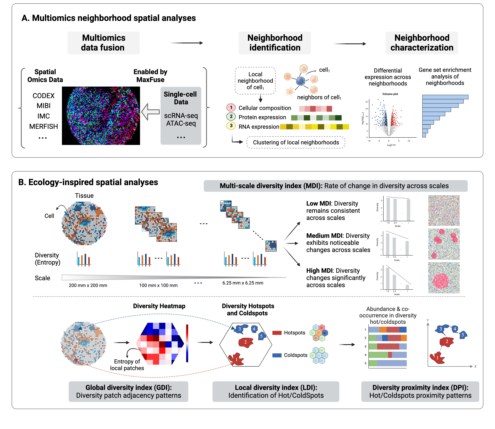

# MESA: Multiomics and Ecological Spatial Analysis for Quantitative Decoding of Cellular Neighborhoods and Tissue Compartments

<p align="center">
  
</p>

MESA is a tool for decoding cellular neighborhoods in spatial omics data. It incorporates a multiomics strategy by integrating single-cell modalities with spatial omics data in silico, thus layering on additional dimensions of information, to facilitate a deeper understanding of cellular neighborhoods and their spatial interactions within tissue microenvironments. It also employs a multi-scale diversity index, along with global and local diversity indices, to systematically quantify cellular diversity and identify diversity hotspots.

## Installation

MESA is hosted on `pypi` and can be installed via `pip`. 

```
pip install mesa
```
Visit our [documentation](https://mesa-py.readthedocs.io/en/latest/) to see examples and tutorials!

## Manuscript
Please see our manuscript `Ding, Tang & Zhu et al. (2024)` in [*biorxiv*]() to learn more.

## License